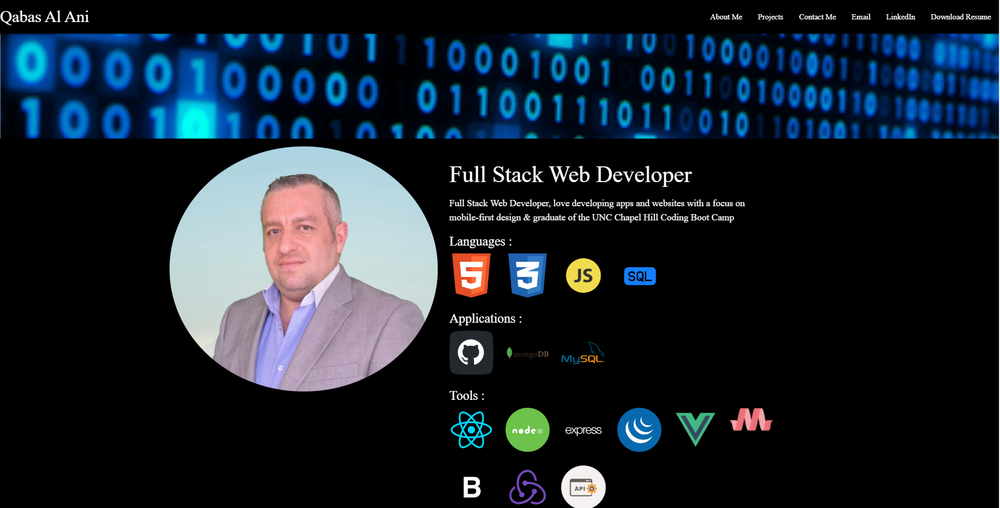
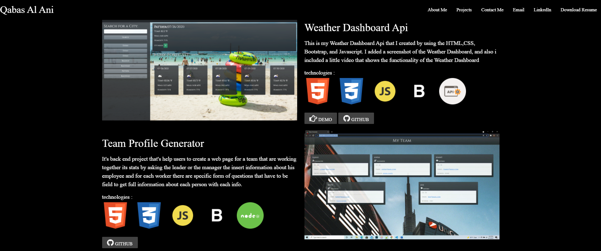
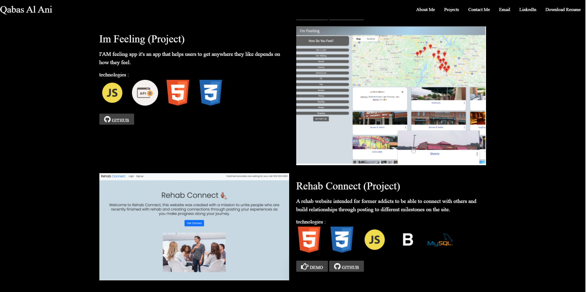
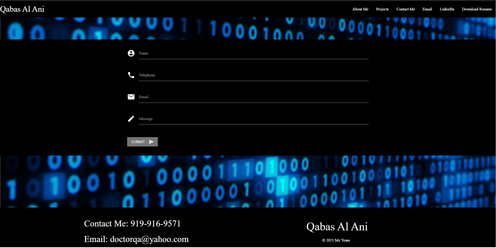

# Personal Portfolio 2

---

[](https://opensource.org/licenses/MIT)

## Table of Contents

- [Description](#description)
- [Technologies](#Technologies)
- [Usage](#usage)
- [Questions](#questions)

## Description:

I updated my personal portfolio and added second page for contact information and also to be used further on if i want to add and extra page.

```
## Technologies
- Html.
-  Css.
-  Javascript.
-  Materialize.
-  Scroll.js.
```

### Usage

to have a look for my work and projects that i've created

### A Screenshot of my deployed personal portfolio






[full demo](https://qabas-al-ani.github.io/Personal-Protfolio-2/)

### Questions?

For any questions, please contact me with the information below:

doctorqa@yahoo.com

[LinkedIn Profile]( https://www.linkedin.com/in/qabas-al-ani-7b858863/ )

[Github Profile]( https://github.com/Qabas-al-ani )
